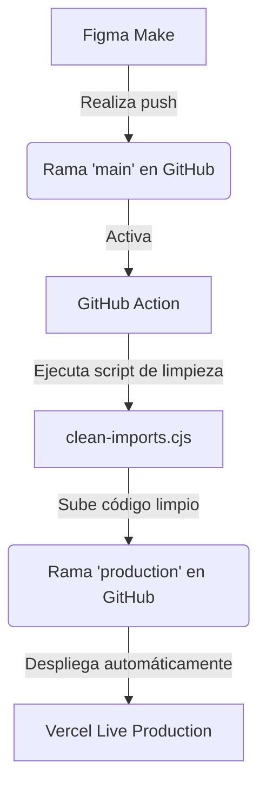

# Instrucciones del Proyecto: Web Jacidi 2026

Este archivo contiene toda la información de arquitectura, flujos de trabajo e instrucciones críticas para que cualquier asistente de IA que trabaje en este repositorio pueda continuar el desarrollo sin fricciones.

---

## 📌 Resumen del Proyecto
* **Tecnologías**: React, Vite, Tailwind CSS v4.
* **Integración**: Los diseños se exportan directamente desde **Figma Make** hacia la rama `main` en GitHub.
* **Problema de Assets**: Figma Make exporta archivos de imágenes locales muy grandes que superan el límite de 50MB de GitHub. Esto causa que las imágenes PNG no se suban, resultando en importaciones rotas (`import "@/imports/Home-1/..."`) dentro de `src/app/App.tsx` y provocando fallos de compilación en Vite/Vercel.

---

## ⚙️ Arquitectura de Ramas y Despliegue en Vercel
Manejamos un flujo automatizado de dos ramas principales:



* **Rama `main`**: Contiene el código fuente en crudo directamente de Figma Make (con los imports rotos).
* **Rama `production`**: Contiene la versión de producción estable y limpia generada automáticamente por la GitHub Action.
* **Vercel**: Está conectado directamente a la rama **`production`** para el despliegue del sitio en vivo.
* **Staging local**: Para realizar pruebas de desarrollo locales de manera segura antes de subir cambios permanentes.

---

## 🛠️ Script de Limpieza (`scripts/clean-imports.cjs`)
El script en `scripts/clean-imports.cjs` está escrito en CommonJS. Debe ejecutarse automáticamente en cada build/push de integración continua para mantener la compilación funcional.

### Funcionalidad del Script:
1. Lee `src/app/App.tsx`.
2. Busca mediante expresiones regulares flexibles las importaciones rotas de `@/imports/Home-1/*.png` que superan los 50MB y no existen localmente.
3. Las reemplaza en caliente por **URLs de imágenes premium y estables de Unsplash** que se adaptan a la paleta de colores minimalista de Jacidi (`#20201f`, `#909090`, `#f26b2d`).

---

## 📸 Reglas para incorporar Imágenes y Videos
* **Imágenes locales**: **NO** subir archivos de imágenes pesados que superen los 50MB a GitHub.
* **Sustitución**: Siempre que figma exporte imágenes rotas, usar URLs estables y curadas de Unsplash u otros servicios CDN rápidos.
* **Excepción**: La única regla para incorporar nuevas imágenes y videos reales locales en el código principal es que estén organizados dentro de un **módulo nuevo**, o que el usuario dé la instrucción explícita.

---

## 🚀 Comandos Útiles

### Iniciar servidor de desarrollo local:
```bash
npm run dev
```

### Ejecutar limpieza de imports localmente:
```bash
node scripts/clean-imports.cjs
```

---

*Nota para el Asistente: Si se realizan cambios locales, asegúrate de mantener intacto el archivo `clean-imports.cjs` y las configuraciones de flujos en `.github/workflows/sync-to-production.yml`.*
